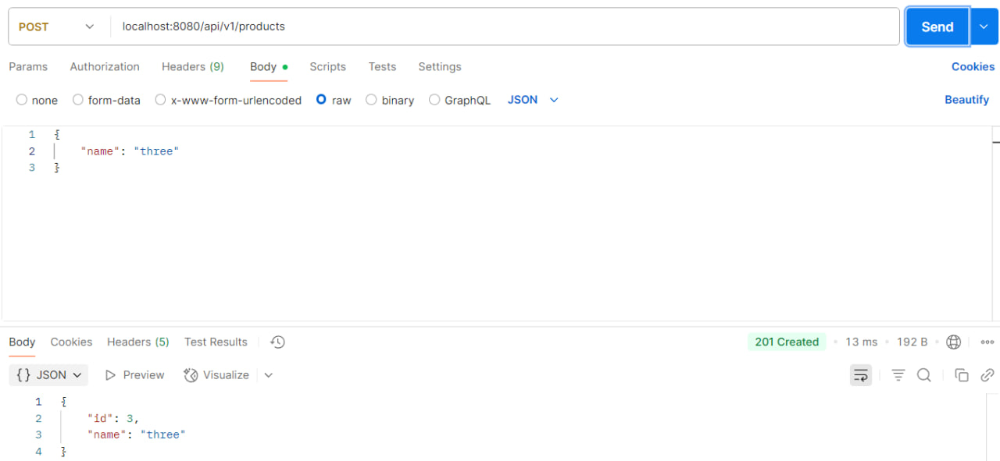
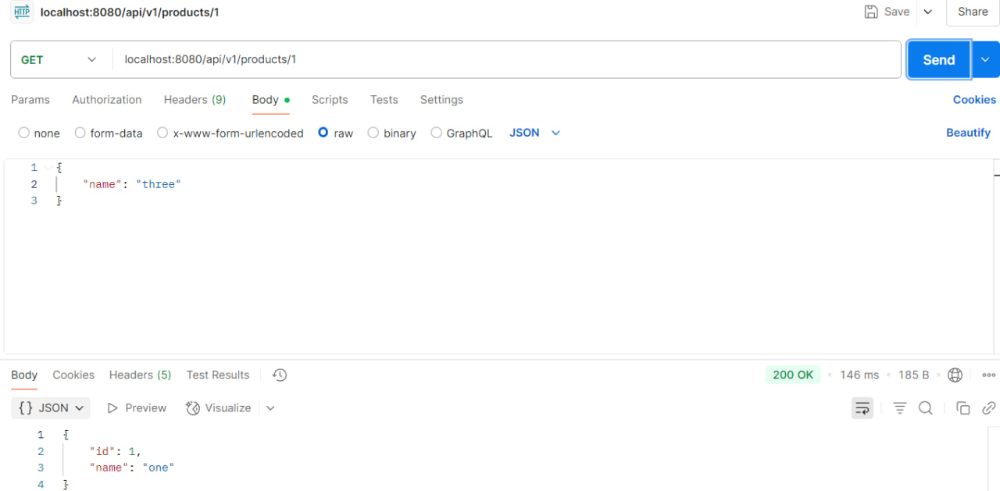
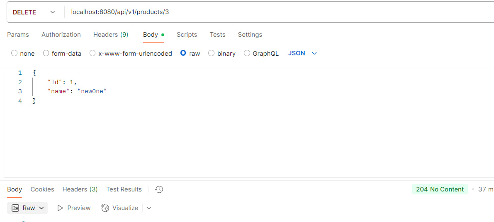
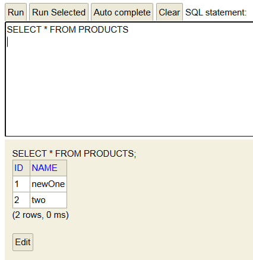

Project name: RestApiSpringJava
Student: Tawananyasha Danha

Description of my project:

This is a program built with Java and Spring Boot. It's like a website backend that helps you handle product details. You can use simple web commands to:

POST new product info.
GET existing product info.
PUT product info.
DELETE product info.

How the Program Works (You can check with a Postman tool):

1. To add a new product, send info to /api/v1/products and use POST. Write its name. Then we have to choose JSON in the Body section. We should get "201 created" if its okay
2. To get product's info, use /api/v1/products and GET. If it's there, you get an "200 OK". If not, you get a "404 not found".
3. To change a product, send new info to /api/v1/products and use PUT. Put the new info. Then we have to choose JSON in the Body section. If it's changed, you get an "200 OK". If the product isn't there, you get a "404 not found" message.
4. To delete a product, use /api/v1/products and DELETE. If the product deleted you get "204 no content". If the product is not found, then "404 not found".

Screenshot that proves my application works:

1. 
2. 
3. 
4. 
5. 
